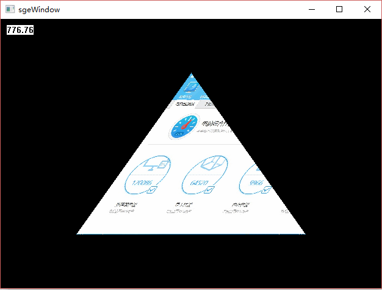

# 第5章：纹理贴图

> 上一章中我们使用扫描线算法画出来具有填充颜色的三角形，本章将使用重心坐标算法绘制具有贴图的三角形，这个贴图我们通常将它叫做纹理。

-------------------
## 图片读取

### stb_image

> stb_image是一个非常轻量级的图片工具库，如果只需要读取图片则只需要stb_imgage.h文件即可，需要注意的是头文件中包含源代码，使用STB_IMAGE_IMPLEMENTATION宏控制，不要多次在源文件中开启该宏避免链接时符号重定义，文件头部含有使用说明，这里我们采用stb_image进行图片读取。

- 封装纹理类
``` c++
// sgeTexture.h

class sgeTexture
{
public:
    sgeTexture(const char* file);
    ~sgeTexture();

    inline const color4b&  pixelAt(int x, int y) const { return _data[(y % _height) * _width + (x % _width)]; }

    inline int  width() const { return _width; }
    inline int  height() const { return _height; }

    const color4b   pixelUV(float u, float v) const;

private:
    color4b*    _data;
    int         _width;
    int         _height;
};

// sgeTexture.cpp
#include "sgeTexture.h"
#define STB_IMAGE_IMPLEMENTATION
#include "stb_image.h"

sgeTexture::sgeTexture(const char * file)
    : _width(0), _height(0), _data(NULL)
{
    assert(file);
    int comp = 0;
    byte* data = stbi_load(file, &_width, &_height, &comp, 4);
    assert(data && "stbi_load failed, see stbi_failure_reason()");
    for (int y = 0; y < _height; ++y)
    {
        int dy = y * _width;
        for (int x = 0; x < _width; ++x)
        {
            // rgba ==> bgra
            Swap(data[(dy + x) * 4 + 0], data[(dy + x) * 4 + 2]);
        }
    }
    _data = (color4b*)data;
}

sgeTexture::~sgeTexture()
{
    if (_data)
    {
        stbi_image_free(_data);
        _data = NULL;
    }
}

const color4b sge::sgeTexture::pixelUV(float u, float v) const
{
    float x = u * _width;
    float y = v * _height;

    return  pixelAt(x, y);
}
```
- pixelUV函数将图片宽高规范在0-1之间，我们只是进行了简单的取就近像素颜色，为了更好的显示效果，可以采用双线性插值等算法提高显示效果。

### FreeImage

> FreeImage图像处理库比stb_image功能更为强大，使用得也比较多，具体使用方法自行百度。

## 重心坐标算法绘制三角形

### 重心坐标算法

> 上一章中已经介绍了重心坐标算法，本人不善文字表达，如有不清楚的地方敬请查阅其他资料。

> 根据重心坐标的意义，点P(Px, Py)在由顶点A(x1, y1)、B(x2, y2)、C(x3, y3)构成的三角形中的重心坐标为（b1, b2, b3）,计面积为S,有：
>> b1 = S(PBC) / S(ABC)
>>
>> b2 = S(PAC) / S(ABC)
>>
>> b3 = S(PBC) / S(ABC)
>>
> S(ABC) = 0.5*[(y1-y3)*(x2-x3)+(y2-y3)*(x3-x1)];
> 同样我们可以算出三个子三角形的面积，注意这里我们没有对顶点进行顺序化，面积可能为负数，但这不影响我们求得重心坐标，我们将分子分母同时乘以2可以简化得到下面试子：
>> b1 * S(ABC) = (Py-y3)*(x2-x3)+(x3-Px)*(y2-y3)
>>
>> b2 * S(ABC) = (Py-y1)*(x3-x1)+(x1-Px)*(y3-y1)
>>
>> b3 * S(ABC) = (Py-y2)*(x1-x2)+(x2-Px)*(y1-y2)
>>
> 根据重心坐标的意义，我们知道重心坐标的同号（均大于0或均小于0）则表示在三角形内部，我们现在只需要判断右边是否同号就可判断点P是否在三角形内部。
> 
> 点P处的纹理坐标将是采用A、B、C的纹理坐标的加权值,这个权就是b1、b2、b3。

### 绘制三角形

> 通过遍历像素点，根据该像素点的重心坐标判断是否在三角线内部，如果在则根据重心坐标计算出该点的纹理坐标，绘制该点。

- 顶点格式，UV即对应纹理坐标，顶点x,y也被规范化到0-1。
``` c++
    // sgeMath.h

    // 2d顶点结构：XY + UV
    template<typename T>
    class XYUV
    {
    public:
        T   x, y;
        T   u, v;
    public:
        XYUV() {}
        XYUV(T x, T y, T u, T v) : x(x), y(y), u(u), v(v) {}
    };

    typedef class XYUV<float>   xyuv;
```

- 求2D点的轴对齐包围盒
``` c++
    // sgeMath.h

    // 2d轴对齐包围盒
    template<typename T>
    class AxisAlignedBox2D
    {
    public:
        T   minX;
        T   minY;
        T   maxX;
        T   maxY;

    public:
        AxisAlignedBox2D(T x, T y) : minX(x), maxX(x), minY(y), maxY(y) {}
        AxisAlignedBox2D(const Vector2<T> & p) : minX(p.x), maxX(p.x), minY(p.y), maxY(p.y) {}

        void update(T x, T y)
        {
            if (x < minX) minX = x;
            else if (x > maxX) maxX = x;
            if (y < minY) minY = y;
            else if (y > maxY) maxY = y;
        }
    };


    typedef class AxisAlignedBox2D<int>     aabb2i;
    typedef class AxisAlignedBox2D<float>   aabb2f;
```

- 实现重心坐标绘制纹理三角形
``` c++
void Canvas::drawTriangle(const xyuv & v1, const xyuv & v2, const xyuv & v3, const sgeTexture & tex)
{
    int x1 = v1.x * _width, x2 = v2.x * _width, x3 = v3.x * _width;
    int y1 = v1.y * _height, y2 = v2.y * _height, y3 = v3.y * _height;
    aabb2i box(x1, y1);
    box.update(x2, y2);
    box.update(x3, y3);

    int dx23 = x2 - x3, dx31 = x3 - x1, dx12 = x1 - x2;
    int dy23 = y2 - y3, dy31 = y3 - y1, dy12 = y1 - y2;
    
    int ss =  dy23 * dx31 - dy31 * dx23;

    if (ss == 0) return; // 三个点在一条直线上

    for (int x = box.minX; x <= box.maxX; ++x)
    {
        if (x < 0) continue;
        if (x >= _width) break;
        for (int y = box.minY; y <= box.maxY; ++y)
        {
            if (y < 0) continue;
            if (y >= _height) break;

            int s1 = (y - y3) * dx23 + (x3 - x) * dy23;
            int s2 = (y - y1) * dx31 + (x1 - x) * dy31;
            int s3 = (y - y2) * dx12 + (x2 - x) * dy12;
            if ((s1 >= 0 && s2 >= 0 && s3 >= 0)
                || (s1 <= 0 && s2 <= 0 && s3 <= 0))
            {
                float b1 = (float)s1 / ss, b2 = (float)s2 / ss, b3 = (float)s3 / ss;
                float fu = b1 * v1.u + b2 * v2.u + b3 * v3.u;
                float fv = b1 * v1.v + b2 * v2.v + b3 * v3.v;
                maskBlend(_pixels[y * _width + x], tex.pixelUV(fu, fv));
            }
        }
    }
}
```


### 本节代码效果图



-------------------
### github链接https://github.com/xiangwencheng1994/sge/tree/master/lesson5.Texture